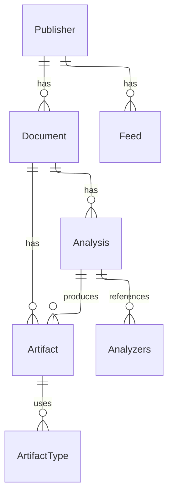

## Publisher

tbd

## Feed

tbd

## Document

Documents are the core datatype that Exonex builds upon. They represent a single, downloaded File and can be created either manually (by a human) or as part of a scraping process.
Documents are used to run Analyses on top of it, which add Artifacts to the Document.
They always belong to a Publisher.

## Analysis

tbd

## Analyzer

tbd

## Artifact

tbd

## ArtifactType

tbd

## Diagram

